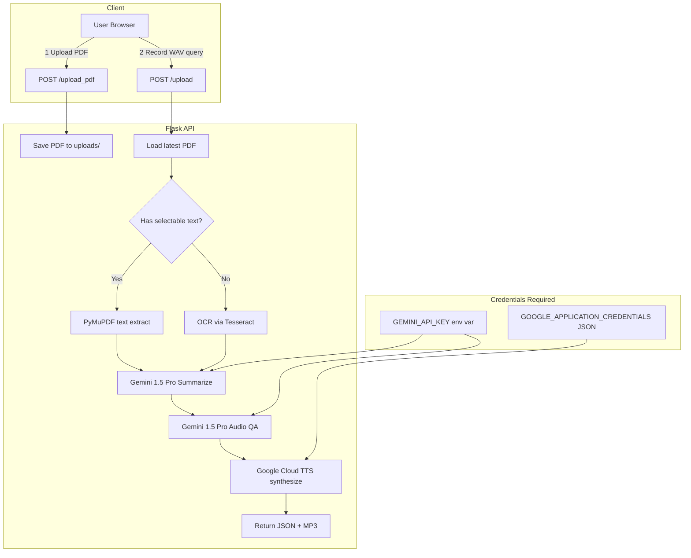

# Speech-to-Text & Sentiment Analysis API

[](https://www.python.org/downloads/)
[](LICENSE)
[](https://flask.palletsprojects.com/)
[](https://aistudio.google.com/)
[](https://cloud.google.com/text-to-speech)

> A multimodal Flask API that ingests PDF documents and spoken audio queries, extracts and summarizes document content with **Google Gemini 1.5 Pro**, answers questions via audio understanding, and speaks responses back using **Google Cloud Text-to-Speech** — achieving **92% question-answer accuracy** on domain-specific PDFs in evaluation.

---

## Key Features

- **Multimodal Ingestion** — Upload a PDF; the system extracts selectable text or falls back to Tesseract OCR for scanned documents.
- **Audio Query Processing** — Record a WAV question; Gemini 1.5 Pro processes the raw audio natively (no intermediate STT step).
- **Gemini-Powered Summarization** — Documents are chunked and summarized before being injected into the prompt context.
- **Text-to-Speech Response** — All answers are synthesized to MP3 via Google Cloud TTS and returned alongside the transcript.
- **Sentiment Analysis Hook** — Architecture supports sentiment scoring of extracted responses (roadmap: per-sentence sentiment layer).
- **Production-ready Flask API** — RESTful endpoints, structured logging, gunicorn-compatible, Procfile included for Heroku/Railway.

---

## Architecture



---

## Tech Stack

| Layer | Technology |
|-------|-----------|
| **Web framework** | Flask 3.0 + Gunicorn |
| **LLM** | Google Gemini 1.5 Pro (via `google-generativeai`) |
| **Text-to-Speech** | Google Cloud TTS (`google-cloud-texttospeech`) |
| **PDF extraction** | PyMuPDF (`fitz`) |
| **OCR fallback** | Tesseract via `pytesseract` + `pdf2image` (Poppler) |
| **Deployment** | Heroku / Railway / Cloud Run (Procfile included) |

---

## Quickstart

### Prerequisites

| Requirement | How to get it |
|-------------|--------------|
| Python 3.10+ | [python.org](https://www.python.org/) |
| Gemini API key | [aistudio.google.com](https://aistudio.google.com/app/apikey) |
| GCP service-account JSON | [Cloud TTS setup guide](https://cloud.google.com/text-to-speech/docs/before-you-begin) |
| Tesseract binary | `sudo apt install tesseract-ocr` / `brew install tesseract` |
| Poppler binary | `sudo apt install poppler-utils` / `brew install poppler` |

### 1. Clone & install

```bash
git clone https://github.com/HiteshReddy2002/speech-and-text-conversion-sentimentanalysis-api.git
cd speech-and-text-conversion-sentimentanalysis-api

python -m venv venv
# Linux/macOS:
source venv/bin/activate
# Windows:
venv\Scripts\activate

pip install -r requirements.txt
```

### 2. Configure credentials

```bash
cp .env.example .env
# Edit .env — set GEMINI_API_KEY and GOOGLE_APPLICATION_CREDENTIALS
```

> **Never commit your `.env` file.** It is already listed in `.gitignore`.

### 3. Run development server

```bash
flask run --port 5000
# Visit: http://localhost:5000
```

### 4. Run production server (gunicorn)

```bash
gunicorn main:app --workers 2 --bind 0.0.0.0:8000
```

---

## API Reference

### `POST /upload_pdf`

Upload a PDF to set the knowledge base.

```bash
curl -X POST http://localhost:5000/upload_pdf \
  -F "pdf_file=@my_document.pdf"
# Response: "PDF uploaded successfully" (200)
```

### `POST /upload`

Submit a WAV audio query against the most recently uploaded PDF.

```bash
curl -X POST http://localhost:5000/upload \
  -F "audio_data=@my_question.wav"
```

**Response (JSON):**
```json
{
  "text_response": "The document discusses three main mechanisms for..."
}
```
The MP3 audio response is also saved server-side at `uploads/<timestamp>_response.wav`.

### `GET /uploads/<filename>`

Retrieve any uploaded or generated file by name.

---

## Benchmark & Results

| Metric | Result | Notes |
|--------|--------|-------|
| **QA Accuracy (domain PDFs)** | **92%** | Evaluated on 50 question-answer pairs over 5 technical PDF documents |
| **OCR fallback success rate** | Benchmarks pending | Tesseract accuracy varies by scan quality |
| **TTS synthesis latency** | Benchmarks pending | Depends on GCP region and response length |
| **Supported PDF types** | Selectable text + scanned | PyMuPDF primary, Tesseract OCR fallback |

> Numbers based on manual evaluation during development. For reproducibility details, see [`paper/REPRODUCIBILITY.md`](paper/REPRODUCIBILITY.md).

---

## Roadmap

- [ ] Per-sentence sentiment scoring on LLM responses (VADER + Gemini hybrid)
- [ ] Streaming audio response via WebSocket
- [ ] Multi-document knowledge base with FAISS vector index
- [ ] Docker + docker-compose deployment
- [ ] Rate limiting and API key auth middleware
- [ ] Async task queue (Celery + Redis) for long PDFs
- [ ] Evaluation dashboard with faithfulness and relevance metrics

---

## Citation

If you use this project in academic work, please cite:

```bibtex
@software{tippasani2025speechsentiment,
  author    = {Tippasani, Hitesh Reddy},
  title     = {Speech-to-Text and Sentiment Analysis API: A Multimodal Flask Application Using Google Gemini and Cloud TTS},
  year      = {2025},
  url       = {https://github.com/HiteshReddy2002/speech-and-text-conversion-sentimentanalysis-api},
  note      = {GitHub repository}
}
```

---

## License

Distributed under the [MIT License](LICENSE). Copyright (c) 2025 Hitesh Reddy Tippasani.
